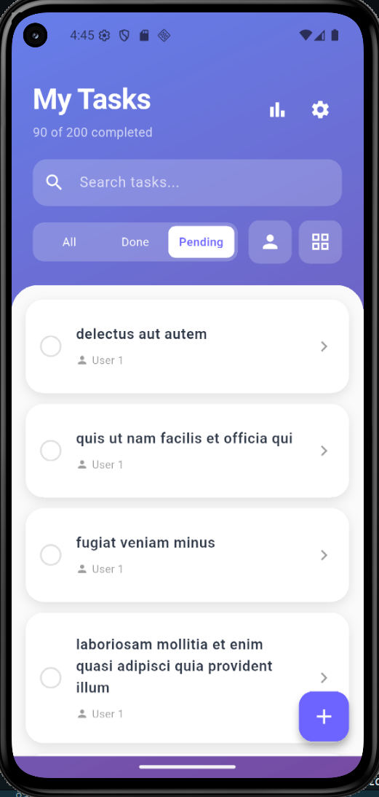
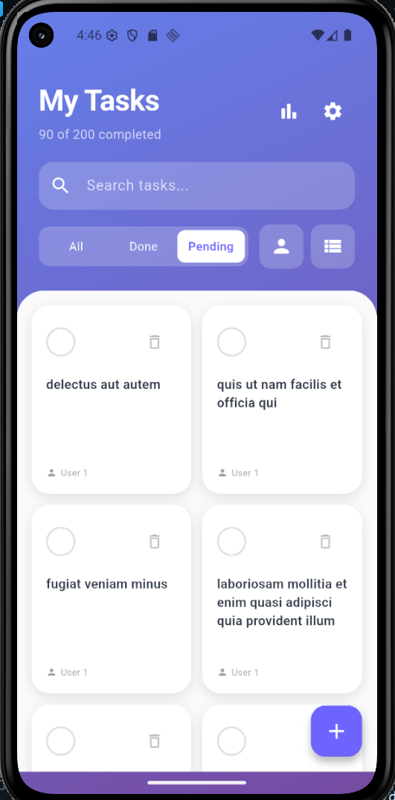
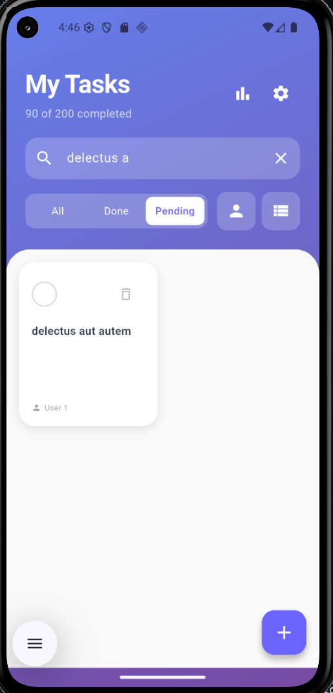
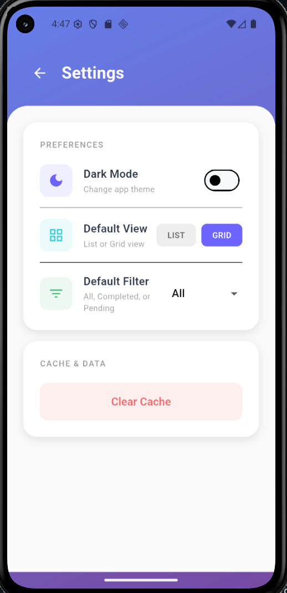
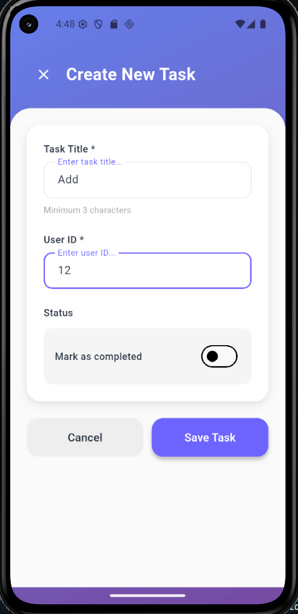
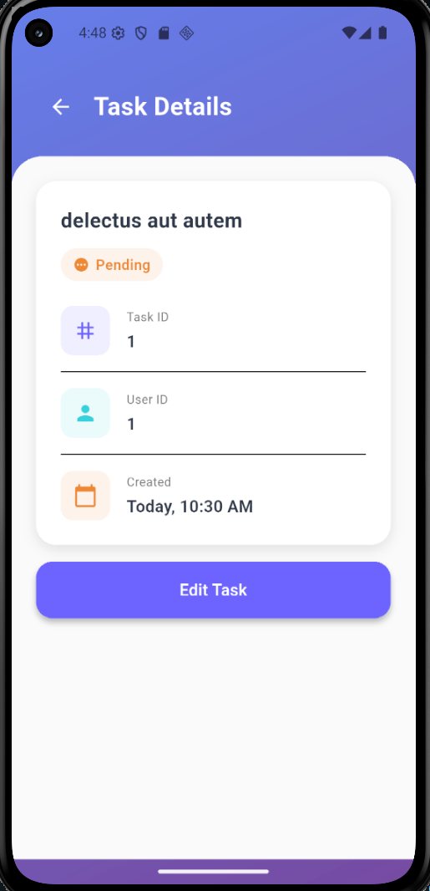
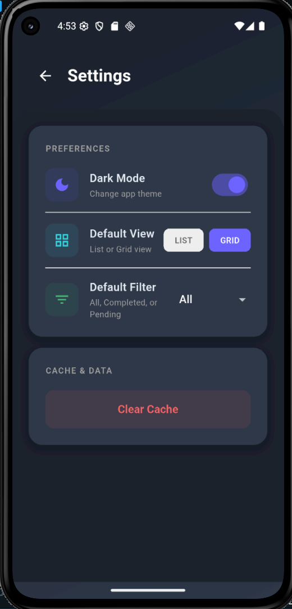
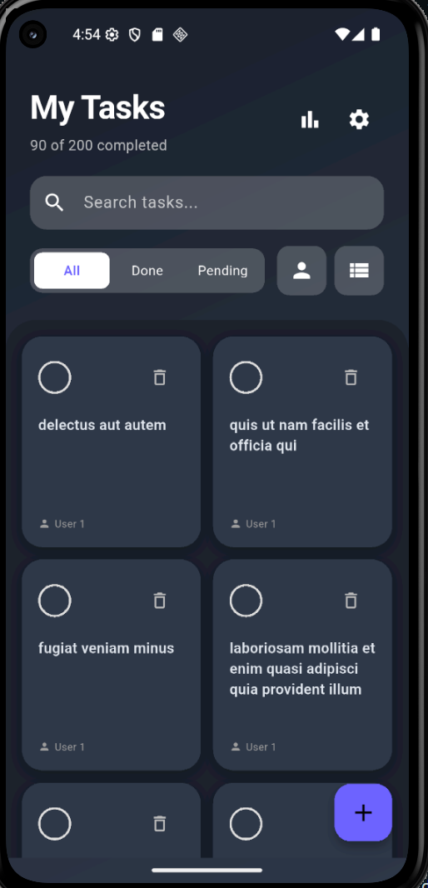
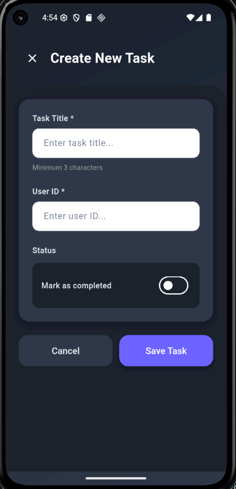
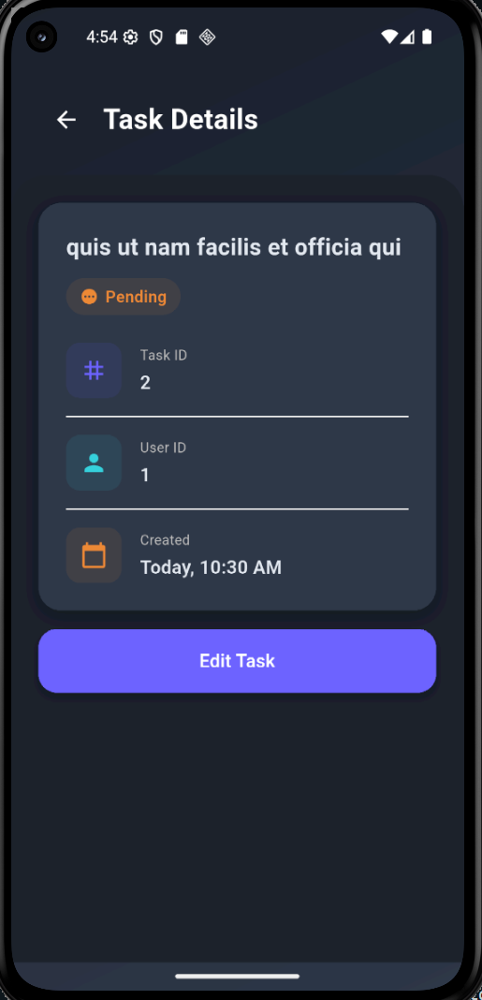

# Task Manager with API Integration

## Description

A professional Flutter application that connects to a REST API to manage tasks (todos) with full offline support, local data persistence, and dynamic UI components. This app demonstrates API integration, JSON parsing, and proper state management in Flutter.

## Features

- **API Integration**: Connect to JSONPlaceholder API for CRUD operations
- **Offline Support**: Cache tasks locally using SharedPreferences
- **Task Management**: Create, view, and filter tasks by completion status
- **Multi-view Display**: Switch between ListView and GridView layouts
- **Dark/Light Theme**: User-selectable theme with persistence
- **Pull-to-Refresh**: Refresh task list with swipe gesture
- **Form Validation**: Comprehensive validation for new task creation
- **Error Handling**: Graceful error states with retry options
- **User Preferences**: Save and restore display preferences

## Screenshots

| Light                                          |                                                |
| ---------------------------------------------- | ---------------------------------------------- |
|   |  |
|  |  |
|  |  |
|  |  |
|  |  |

| Dark                                            |                                                 |
| ----------------------------------------------- | ----------------------------------------------- |
|   |  |
|  |  |

## Project Structure

```bash

lib/
├── main.dart # Application entry point
├── models/
│ └── task.dart # Task model with JSON serialization
├── services/
│ ├── api_service.dart # Handles all API calls
│ └── cache_service.dart # Manages local storage
│ ├── connectivity_service.dart
│ └── offline_queue_service.dart
├── screens/
│ ├── home_screen.dart # Main screen with task list
│ ├── settings_screen.dart
│ ├── statistics_screen.dart
│ ├── task_detail_screen.dart
│ ├── task_edit_screen.dart
│ └── task_form_screen.dart
├── widgets/
│ ├── shimmer_loading.dart
│ └── statistics_card.dart
└── utils/
    └── app_styles.dart
├── app_styles.dart
```

## 🚀 How to Run

1. **Clone the repository**

```bash
git clone https://github.com/YOUR_USERNAME/task_manager.git
cd task_manager
```

2. **Install dependencies**

```bash
flutter pub get
```

3. **Run the application**

```bash
flutter run
```

## Dependencies

- dependencies:
  - flutter:
    - sdk: flutter
  - http: ^1.1.0
  - shared_preferences: ^2.2.2

## API Endpoints

| Method | Endpoint    | Description       |
| ------ | ----------- | ----------------- |
| GET    | /todos      | Fetch all tasks   |
| GET    | /todos/{id} | Fetch single task |
| POST   | /todos      | Create new task   |

## Validation Rules

- Task Title: Required, minimum 3 characters
- User ID: Required, positive integer
- Completion Status: Boolean toggle
- Form Validation: Real-time validation with error messages

## Cache Management

- Automatic caching on successful API fetch
- Offline mode with cached data
- Cache expiration management
- User preference persistence

## UI Components

- FutureBuilder for async operations
- ListView.builder and GridView.builder
- RefreshIndicator for pull-to-refresh
- Custom loading indicators
- Error widgets with retry functionality

# What I Learned

- Making HTTP requests and handling responses
- JSON parsing and serialization
- Implementing FutureBuilder for async operations
- Local data persistence with SharedPreferences
- Error handling in Flutter applications
- Building responsive UIs with ListView/GridView
- Form validation and user input handling
- Managing user preferences and app settings
